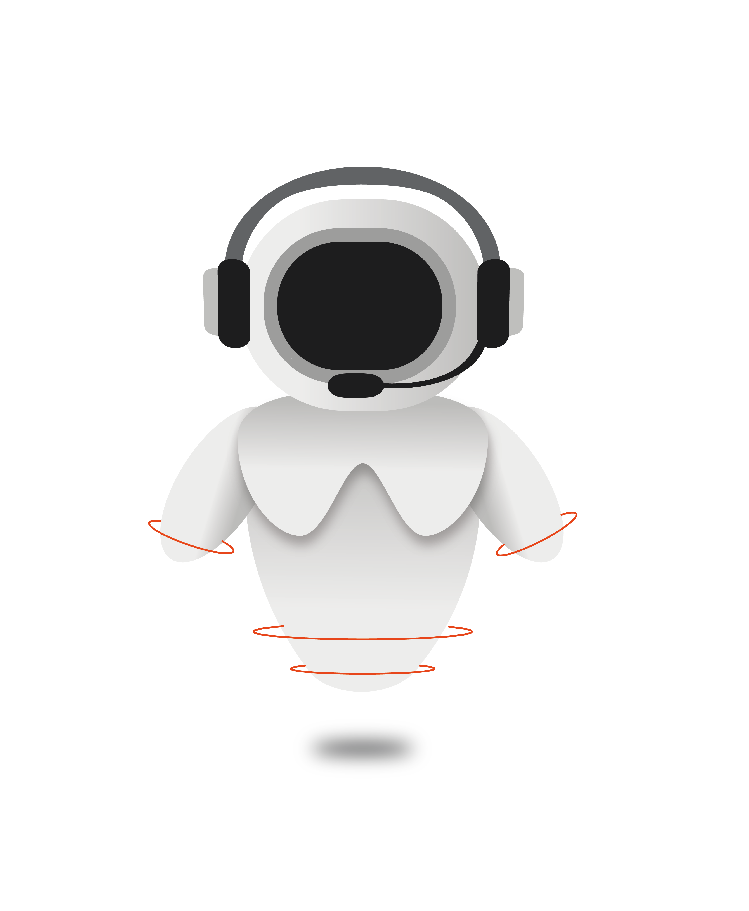

# Konzeptentwurf Plausibilitätsillusion

### Thema und Forschungsfrage
Wie wirkt sich plausibles Verhalten eines virtuellen Charakters (z. B. Blickkontakt, Reaktionsfähigkeit) auf die wahrgenommene Präsenz im Raum in einer VR-Anwendung aus?

### Interaktionskonzept
  
Konzeptgrafik Roboter von pia659

Im Rahmen dieses Projekts wird untersucht, wie sich das Verhalten virtueller Charaktere auf die Wirkung von VR-Inhalten auswirkt, insbesondere im Hinblick auf Lernprozesse und Nutzererleben. Dazu wird eine VR-Anwendung entwickelt, in der der virtuelle Roboter „Karlchen“ den Nutzer durch kurze Lerneinheiten führt.

Es werden zwei Versionen von Karlchen erstellt, die sich im Grad ihrer Verhaltensplausibilität unterscheiden:

1. Karlchen mit plausiblen Verhaltensweisen:
Diese Version interagiert aktiv mit dem Nutzer. Sie nimmt Blickkontakt auf, reagiert auf Gesten und spricht den Nutzer direkt an. Ziel ist es, eine möglichst natürliche und glaubwürdige soziale Interaktion zu simulieren.

2. Karlchen ohne plausibles Verhalten:
In dieser Variante bleibt der Roboter statisch. Er führt keine aktiven Interaktionen mit dem Nutzer durch und gibt Informationen lediglich nach einem Buttonklick weiter. Es findet kein erkennbares soziales Verhalten statt.

Die beiden Roboter wechseln sich in kurzen Sequenzen innerhalb der VR-Anwendung ab. 
Am Ende folgt eine kurze Abfrage – in Form einer Meinungsabfrage – um zu erfassen, wie sich die Unterschiede im Verhalten der Charaktere auf die wahrgenommene Präsenz im virtuellen Raum auswirken.

Das Ziel ist es, herauszufinden, ob und in welchem Ausmaß die Plausibilität virtueller Charaktere die Präsenz in einer VR-Umgebung beeinflusst.

Die Tabelle zeigt die Merkmale der beiden Roboter:

| **Merkmal**             | **Hohe Plausibilität**                                                                                                                                                                                                                                                                                                                           | **Geringe Plausibilität**                                                                                                                           |
| ----------------------- | ------------------------------------------------------------------------------------------------------------------------------------------------------------------------------------------------------------------------------------------------------------------------------------------------------------------------------------------------ | --------------------------------------------------------------------------------------------------------------------------------------------------- |
| Reaktions-möglichkeiten | Der Roboter reagiert jederzeit auf Gesten oder Blickkontakt sowie Handlung/Interaktion mit ihm. Er reagiert auch auf ähnliche Dinge, die man mit dem anderen Roboter macht.  Je nach Abschnitt bestehen gewisse Möglichkeiten zu Handlungen/Interaktionen mit Gegenständen oder im Raum, auf die der Roboter jeweils reagieren kann. Die Anwendung wird automatisch fortgeführt, wenn der Nutzer eine Ziel oder eine Aufgabe erfüllt hat. | Die Anwendung und der Roboter werden per Button aktiviert und fortgeführt. Es bestehen keine automatischen Reaktionen.                          |
| Reaktions-verhalten     | Der Roboter spricht vorgefertigte Sätze, die sich auf die gewissen Situationen und definierten Interaktionsmöglichkeiten beziehen.  Der Roboter besitzt entsprechende Gestik und Bewegung (Blickkontakt, Mund und Augen bewegen sich, Winken).                                                                                           | Der Roboter spricht zufällige und oberflächliche Sätze, die nicht auf die Situation abgestimmt sind.  Der Roboter besitzt eintönige Gestik. |
| Raum-verhalten          | Der Roboter läuft oder schwebt durch den Raum und zeigt auf Objekte, von denen er spricht. Er spricht den Spieler direkt an.                                                                                                                                                                                                                 | Der Roboter bleibt ortsgebunden oder teleportiert sich. Er spricht vom Spieler in dritter Person.                                               |
| Präsenz                 | Der Roboter baut Beziehungen mit dem Nutzer auf, merkt sich den Verlauf der Geschehnisse und lobt ausgeführte Aktionen.                                                                                                                                                                                                                          | Der Roboter geht strikt zum nächsten Thema über.                                                                                                    |

# Zeitplan

| **Meilenstein** | **Frist**  | **Ziele & Aufgaben** |
|-------------|--------|----------|
| 1           | 30.04  | **Ziel** Bestehende Grundlagen und ausgearbeitetes Konzept  **Alle** - Konzept erstellen - Git-Repository anlegen (AVR2025-Plausibilitaetsillusion) - Erste Commits der Teammitglieder    **maikbartelsII** - Zusammenfassende Präsentation erstellen|
| 2           | 07.05  | **Ziel** Technische Basis und Skript der Anwendung  **Alle** - Verbindung mit der Quest ermöglichen - Thema und passende Interaktionen/Objekte auswählen - Skript mit exakten Texten, Interaktionen und Ablauf erstellen - Detailliertes Ablaufdiagramm mit den definierten Interaktionsmöglichkeiten erstellen  **RoxiBu** - Projekt in Unity anlegen und grobe Szene erstellen |
| 3           | 04.06  | **Ziel** Funktionstüchtige VR-Anwendung nach erstelltem Skript  **RoxiBu** - Roboter 3D-Modellierung, Assets und Animationen erstellen - Roboter Mimik & Gestik programmieren  **pia659** - Gegenstände und Raum modellieren - Gegenstände und Interaktionsmöglichkeiten programmieren  **panieldeschel** - Roboter Tonspuren, Umgebungs- und Gegenstandsgeräusche erstellen & einbinden - Anwendungsverlauf und -logik programmieren  **maikbartelsII** - Roboter Logik, Gestik & Verhalten programmieren - Szenen programmieren |
| 4           | 25.06  | **Ziel** Vervollständigte und erweiterte Anwendungslogik  **Alle** - Programmierung ergänzen und verbessern |
| 5           | 06.07  | **Ziel** Fertiggestelltes Projekt  **Alle** - Testen & verbessern - Abschlusspräsentation |
